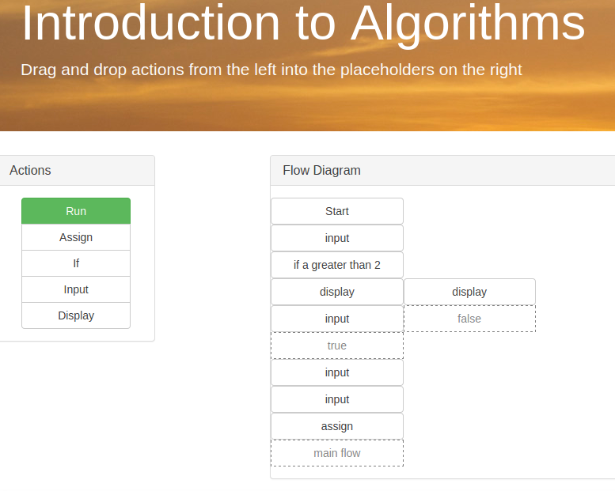
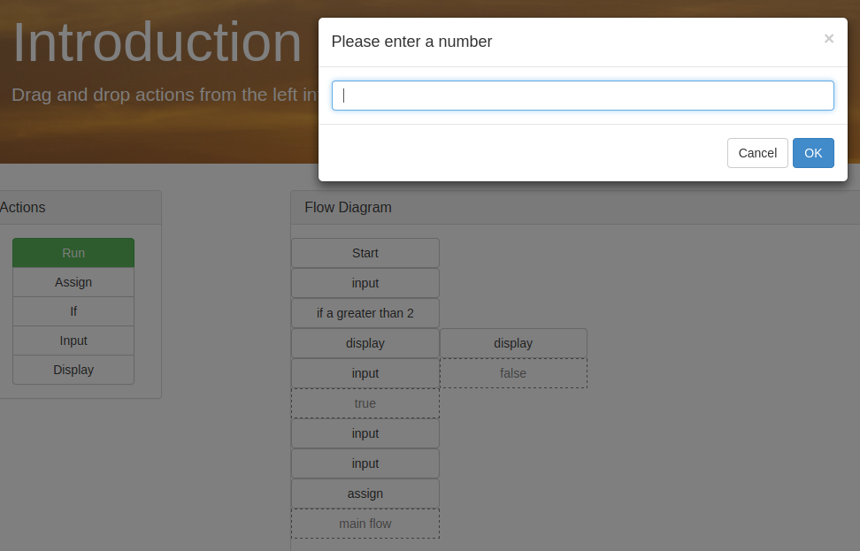

# Introduction to algorithms

## Description

This is a simple introduction to algorithms. The idea of this project is to teach the basics of algorithm. We do not intend to teach any particular programming language. We want to teach our students that you are writing instructions step by step and the order of execution matters. This project addresses the theme number 2: Introduce software development to a beginner.

[Visit the app](http://uekk5410012c.elfotografo007.koding.io/)

## Screenshots

## APIs used

We used:
* [Bootstrap](http://getbootstrap.com/)
* [Bootbox.js](http://bootboxjs.com/)
* [jQuery](http://jquery.com/)
* [jQueryUI](http://jqueryui.com/)